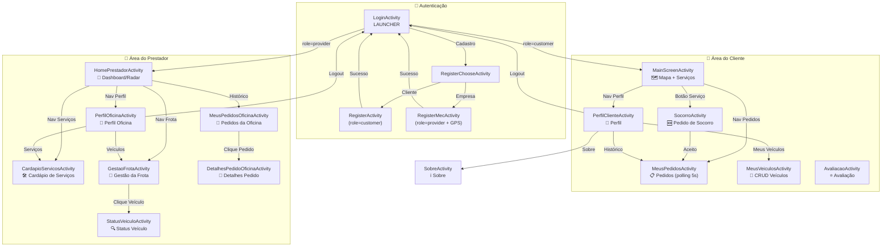
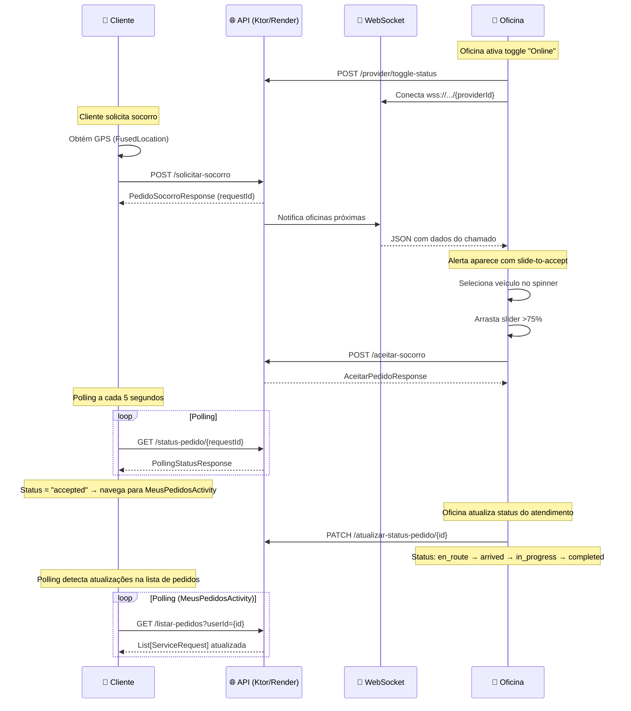

# 📘 Documentação Técnica Completa — Projeto Salvô

> **Versão:** 1.0 &nbsp;|&nbsp; **Data:** 31/05/2026 &nbsp;|&nbsp; **Plataforma:** Android (Kotlin)

---

## 📑 Índice

1. [Visão Geral do Projeto](#1-visão-geral-do-projeto)
2. [Stack Tecnológica](#2-stack-tecnológica)
3. [Estrutura de Pacotes](#3-estrutura-de-pacotes)
4. [Permissões do Aplicativo](#4-permissões-do-aplicativo)
5. [Models (Modelos de Dados)](#5-models-modelos-de-dados)
6. [Activities (Telas)](#6-activities-telas)
7. [Camada de Rede (Network)](#7-camada-de-rede-network)
8. [Adapters (Adaptadores de Lista)](#8-adapters-adaptadores-de-lista)
9. [Dialogs (Diálogos)](#9-dialogs-diálogos)
10. [Utilitários](#10-utilitários)
11. [Recursos XML](#11-recursos-xml)
12. [Navegação Completa Entre Telas](#12-navegação-completa-entre-telas)
13. [Fluxo de Dados em Tempo Real](#13-fluxo-de-dados-em-tempo-real)
14. [Glossário de Termos](#14-glossário-de-termos)

---

## 1. Visão Geral do Projeto

O **Salvô** é um aplicativo Android nativo desenvolvido em **Kotlin** que conecta **motoristas/clientes** a **oficinas mecânicas e prestadores de serviço automotivo**. O app funciona como um marketplace de serviços mecânicos com foco em **socorro mecânico em tempo real**, onde o cliente pode solicitar ajuda e a oficina mais próxima recebe o chamado instantaneamente via WebSocket.

### 🎯 Objetivo Principal
Permitir que motoristas encontrem e solicitem serviços mecânicos (guincho, bateria, pneu, mecânica geral) de forma rápida, com acompanhamento em tempo real do status do atendimento.

### 👥 Dois Perfis de Usuário

| Perfil | Role no Sistema | Tela Principal | Funcionalidades |
|--------|----------------|----------------|-----------------|
| **Cliente** (Motorista) | `customer` | `MainScreenActivity` | Solicitar socorro, gerenciar veículos, acompanhar pedidos |
| **Prestador** (Oficina) | `provider` | `HomePrestadorActivity` | Receber chamados em tempo real, gerenciar frota, cardápio de serviços, perfil |

### 🏗️ Arquitetura do Sistema

```
┌──────────────────────┐         ┌──────────────────────────────┐
│   App Android (Salvô)│◄──REST──►  Backend API (Ktor)          │
│   • Kotlin           │         │  • Hospedado no Render       │
│   • Retrofit (HTTP)  │◄──WS───►  • apisalvologin.onrender.com│
│   • ViewBinding      │         │  • WebSocket para tempo real │
│   • MVVM (parcial)   │         └──────────────────────────────┘
│   • Google Maps SDK  │
│   • Google Places SDK│
└──────────────────────┘
```

> [!NOTE]
> Embora as dependências do Firebase estejam declaradas no `build.gradle.kts`, **o projeto NÃO utiliza Firebase**. Toda a comunicação é feita via API REST (Retrofit) e WebSocket com o backend próprio hospedado no Render.

---

## 2. Stack Tecnológica

### Linguagem e Plataforma
| Componente | Tecnologia | Versão |
|------------|-----------|--------|
| Linguagem | Kotlin | JDK 11 |
| Min SDK | Android 7.1 (API 25) | — |
| Target SDK | Android 16 (API 36) | — |
| Namespace | `com.example.salvo` | — |
| Build System | Gradle (Kotlin DSL) | — |

### Dependências Principais
| Biblioteca | Propósito | Versão |
|-----------|-----------|--------|
| **Retrofit 2** | Chamadas HTTP REST à API | 2.9.0 |
| **Gson Converter** | Serialização/deserialização JSON | 2.9.0 |
| **OkHttp Logging** | Log de requisições HTTP (debug) | 4.11.0 |
| **Google Maps SDK** | Exibição de mapas | 18.2.0 |
| **Google Places SDK** | Autocomplete de endereços | 3.3.0 |
| **Play Services Location** | GPS e localização | 21.2.0 |
| **Material Design 3** | Componentes visuais | 1.11.0 |
| **Lifecycle ViewModel** | MVVM (ViewModel + StateFlow) | 2.7.0 |
| **Lifecycle Runtime KTX** | Coroutines com ciclo de vida | 2.7.0 |
| **ConstraintLayout** | Layouts flexíveis | 2.1.4 |
| **AppCompat** | Compatibilidade retroativa | 1.6.1 |

### Features do Build
| Feature | Status |
|---------|--------|
| ViewBinding | ✅ Ativado |
| Minify (ProGuard) | ❌ Desativado (release) |

---

## 3. Estrutura de Pacotes

```
com.example.salvo/
│
├── 📄 LoginActivity.kt              ← Ponto de entrada (LAUNCHER)
├── 📄 RegisterChooseActivity.kt      ← Seleção tipo de cadastro
├── 📄 RegisterActivity.kt            ← Cadastro de cliente
├── 📄 RegisterMecActivity.kt         ← Cadastro de prestador (com GPS)
│
├── 📄 MainScreenActivity.kt          ← Home do CLIENTE (mapa + serviços)
├── 📄 SocorroActivity.kt             ← Solicitar socorro mecânico
├── 📄 MeusPedidosActivity.kt         ← Pedidos do cliente (polling 5s)
├── 📄 MeusVeiculosActivity.kt        ← CRUD de veículos do cliente
├── 📄 PerfilClienteActivity.kt       ← Perfil do cliente
├── 📄 AvaliacaoActivity.kt           ← Avaliar serviço (placeholder)
│
├── 📄 HomePrestadorActivity.kt       ← Home do PRESTADOR (dashboard/radar)
├── 📄 HomePrestadorViewModel.kt      ← ViewModel do prestador (MVVM)
├── 📄 CardapioServicosActivity.kt    ← CRUD do cardápio de serviços
├── 📄 GestaoFrotaActivity.kt         ← Gestão da frota de veículos
├── 📄 StatusVeiculoActivity.kt       ← Detalhes/status de um veículo
├── 📄 MeusPedidosOficinaActivity.kt  ← Pedidos da oficina
├── 📄 DetalhesPedidoOficinaActivity.kt← Detalhes de um pedido (oficina)
├── 📄 PerfilOficinaActivity.kt       ← Perfil da oficina (edição completa)
│
├── 📄 SobreActivity.kt               ← Tela institucional "Sobre"
├── 📄 InputMaskUtil.kt               ← Máscaras de formatação
├── 📄 PerfilRepository.kt            ← Repository: toggle online/offline
├── 📄 ProviderHomeRepository.kt      ← Repository vazio (placeholder)
│
├── 📁 model/                         ← Modelos de dados (9 arquivos)
│   ├── LoginResponses.kt             ← RegisterRequest
│   ├── User.kt                       ← LoginRequest, AuthResponse
│   ├── MatchModels.kt                ← PedidoSocorroRequest/Response
│   ├── OficinaPerfil.kt              ← Perfil da oficina
│   ├── ProviderServiceResponse.kt    ← Serviços públicos da oficina
│   ├── ServiceItem.kt                ← Item de serviço (gestão interna)
│   ├── ServiceRequest.kt             ← Pedido completo (+ helpers + polling)
│   ├── Vehicle.kt                    ← Veículo da frota
│   └── VeiculoRequest.kt             ← Request p/ adicionar/editar veículo
│
├── 📁 network/                       ← Camada de rede (2 arquivos)
│   ├── RetrofitClient.kt             ← Singleton Retrofit + 22 endpoints
│   └── WebSocketManager.kt           ← WebSocket para chamados em tempo real
│
├── 📁 adapter/                       ← Adaptadores de RecyclerView (5 arquivos)
│   ├── PedidosAdapter.kt             ← Lista de pedidos (cliente)
│   ├── PedidosOficinaAdapter.kt      ← Lista de pedidos (oficina)
│   ├── RecentActivityAdapter.kt      ← Atividades recentes (dashboard)
│   ├── ServiceAdapter.kt             ← Cardápio de serviços
│   └── VehicleAdapter.kt             ← Frota de veículos
│
├── 📁 dialog/                        ← Diálogos customizados (3 arquivos)
│   ├── OrderDetailsDialog.kt         ← Detalhes de pedido (BottomSheet)
│   ├── OrderStatusDialog.kt          ← Alterar status de pedido
│   └── ServicePriceModeDialog.kt     ← Modo de precificação
│
└── 📁 utils/                         ← Utilitários (1 arquivo)
    └── SessionManager.kt             ← Gerenciamento de sessão (SharedPreferences)
```

---

## 4. Permissões do Aplicativo

Definidas no [AndroidManifest.xml](file:///c:/Users/GleissonBdf/Documents/GitHub/Salvo/app/src/main/AndroidManifest.xml):

| Permissão | Propósito |
|-----------|-----------|
| `ACCESS_NETWORK_STATE` | Verificar conectividade de rede |
| `INTERNET` | Chamadas HTTP à API e WebSocket |
| `ACCESS_FINE_LOCATION` | GPS de alta precisão (obrigatório para prestadores e socorro) |
| `ACCESS_COARSE_LOCATION` | Localização aproximada (fallback) |

> [!IMPORTANT]
> A flag `android:usesCleartextTraffic="true"` está habilitada no Manifest, permitindo tráfego HTTP não criptografado. Isso é necessário apenas durante o desenvolvimento — em produção, recomenda-se usar somente HTTPS.

---

## 5. Models (Modelos de Dados)

Todos os models estão no pacote `com.example.salvo.model/`.

---

### 5.1 `LoginRequest` — [User.kt](file:///c:/Users/GleissonBdf/Documents/GitHub/Salvo/app/src/main/java/com/example/salvo/model/User.kt)

Modelo para requisição de login.

| Campo | Tipo | Descrição |
|-------|------|-----------|
| `email` | `String` | Email do usuário |
| `password` | `String` | Senha do usuário |

---

### 5.2 `AuthResponse` — [User.kt](file:///c:/Users/GleissonBdf/Documents/GitHub/Salvo/app/src/main/java/com/example/salvo/model/User.kt)

Resposta padrão da API para autenticação e operações CRUD.

| Campo | Tipo | Descrição |
|-------|------|-----------|
| `sucesso` | `Boolean` | Se a operação foi bem-sucedida |
| `message` | `String` | Mensagem descritiva |
| `userId` | `Int?` | ID do usuário (nullable) |
| `nome` | `String?` | Nome do usuário (nullable) |
| `role` | `String?` | Perfil: `"customer"` ou `"provider"` |
| `token` | `String?` | Token de autenticação (nullable) |

> [!NOTE]
> `AuthResponse` é reutilizado como retorno padrão em diversas rotas da API (login, cadastro, CRUD de veículos, serviços, etc.), não apenas para autenticação.

---

### 5.3 `RegisterRequest` — [LoginResponses.kt](file:///c:/Users/GleissonBdf/Documents/GitHub/Salvo/app/src/main/java/com/example/salvo/model/LoginResponses.kt)

Modelo de requisição para cadastro de novos usuários.

| Campo | Tipo | Serializado como | Descrição |
|-------|------|-------------------|-----------|
| `nome` | `String` | `nome` | Nome completo ou razão social |
| `email` | `String` | `email` | Email |
| `cpf` | `String` | `cpf` | CPF (cliente) ou CNPJ (prestador) |
| `telefone` | `String` | `telefone` | Telefone com DDD |
| `password` | `String` | `password` | Senha |
| `role` | `String` | `role` | `"customer"` ou `"provider"` |
| `latitude` | `Double` | `latitude` | Lat GPS (0.0 para clientes) |
| `longitude` | `Double` | `longitude` | Lng GPS (0.0 para clientes) |

---

### 5.4 `PedidoSocorroRequest` — [MatchModels.kt](file:///c:/Users/GleissonBdf/Documents/GitHub/Salvo/app/src/main/java/com/example/salvo/model/MatchModels.kt)

Requisição para solicitar socorro mecânico.

| Campo | Tipo | Descrição |
|-------|------|-----------|
| `customerId` | `Int` | ID do cliente |
| `clienteNome` | `String` | Nome do cliente |
| `latitude` | `Double` | Latitude atual do cliente |
| `longitude` | `Double` | Longitude atual do cliente |
| `serviceType` | `String` | Tipo: "Guincho", "Bateria", "Pneu", "Mecânica" |
| `vehicleId` | `Int` | ID do veículo do cliente |
| `description` | `String` | Descrição do problema |

---

### 5.5 `PedidoSocorroResponse` — [MatchModels.kt](file:///c:/Users/GleissonBdf/Documents/GitHub/Salvo/app/src/main/java/com/example/salvo/model/MatchModels.kt)

Resposta da API ao solicitar socorro.

| Campo | Tipo | Descrição |
|-------|------|-----------|
| `sucesso` | `Boolean` | Se o pedido foi criado |
| `mensagem` | `String` | Mensagem descritiva |
| `requestId` | `Int?` | ID do pedido criado |
| `mecanicosNotificados` | `Int` | Quantos mecânicos foram notificados via WebSocket |

---

### 5.6 `ServiceRequest` — [ServiceRequest.kt](file:///c:/Users/GleissonBdf/Documents/GitHub/Salvo/app/src/main/java/com/example/salvo/model/ServiceRequest.kt)

**Modelo central** — representa um pedido de serviço completo. É o model mais utilizado no projeto.

| Campo | Tipo | Serializado como | Descrição |
|-------|------|-------------------|-----------|
| `id` | `Int` | `id` | ID do pedido |
| `customerId` | `Int` | `customer_id` | ID do cliente |
| `prestadorNome` | `String?` | `prestador_nome` | Nome da oficina que aceitou |
| `clienteNome` | `String?` | `cliente_nome` | Nome do cliente |
| `serviceType` | `String` | `service_type` | Tipo do serviço |
| `description` | `String` | `description` | Descrição do problema |
| `vehicleInfo` | `String?` | `vehicle_info` | Info do veículo do cliente |
| `status` | `String` | `status` | Status atual do pedido |
| `assignedProviderId` | `Int?` | `assigned_provider_id` | ID da oficina designada |
| `finalPrice` | `Double?` | `final_price` | Valor final do serviço |
| `finalDistance` | `Double?` | `final_distance` | Distância em km |
| `destinoAddress` | `String?` | `destino_address` | Endereço de destino |
| `createdAt` | `String` | `created_at` | Data/hora de criação (UTC) |
| `prestadorFoto` | `String?` | `prestador_foto` | Foto Base64 do prestador |
| `veiculoPrestadorNome` | `String?` | `veiculo_prestador_nome` | Veículo usado pelo prestador |
| `veiculoPrestadorPlaca` | `String?` | `veiculo_prestador_placa` | Placa do veículo do prestador |
| `latitude` | `Double?` | `latitude` | Lat de origem do pedido |
| `longitude` | `Double?` | `longitude` | Lng de origem do pedido |

**Métodos Helper:**

| Método | Retorno | Exemplo |
|--------|---------|---------|
| `getPrecoFormatado()` | `String` | `"R$ 150,00"` ou `"Pendente"` |
| `getDistanciaFormatada()` | `String` | `"15,5 km"` ou `""` |
| `getStatusTraduzido()` | `String` | Traduz status EN → PT |

**Mapa de Tradução de Status:**

| Status (banco) | Tradução (PT) |
|----------------|---------------|
| `searching` | Buscando Oficina... |
| `en_route` | A caminho |
| `accepted` | Confirmado |
| `arrived` | No Local |
| `in_progress` | Em Andamento |
| `completed` | Concluído |
| `canceled` | Cancelado |

---

### 5.7 `PollingStatusResponse` — [ServiceRequest.kt](file:///c:/Users/GleissonBdf/Documents/GitHub/Salvo/app/src/main/java/com/example/salvo/model/ServiceRequest.kt)

Resposta do polling de status do pedido de socorro.

| Campo | Tipo | Descrição |
|-------|------|-----------|
| `status` | `String` | Status atual: `"searching"`, `"accepted"`, `"canceled"` |
| `razaoCancelamento` | `String?` | Motivo do cancelamento (se aplicável) |
| `detalhesOficina` | `OficinaDetalhesPolling?` | Dados da oficina que aceitou |

---

### 5.8 `OficinaDetalhesPolling` — [ServiceRequest.kt](file:///c:/Users/GleissonBdf/Documents/GitHub/Salvo/app/src/main/java/com/example/salvo/model/ServiceRequest.kt)

Detalhes da oficina que aceitou o socorro (retornado no polling).

| Campo | Tipo | Descrição |
|-------|------|-----------|
| `nome` | `String` | Nome da oficina |
| `fotoPerfil` | `String?` | Foto de perfil Base64 |
| `valorFinal` | `Double` | Valor calculado do serviço |
| `distanciaKm` | `Double` | Distância em km |
| `nomeVeiculo` | `String?` | Veículo designado |
| `placaVeiculo` | `String?` | Placa do veículo |

---

### 5.9 `AceitarPedidoRequestApp` — [ServiceRequest.kt](file:///c:/Users/GleissonBdf/Documents/GitHub/Salvo/app/src/main/java/com/example/salvo/model/ServiceRequest.kt)

Requisição enviada quando uma oficina aceita um pedido de socorro.

| Campo | Tipo | Serializado como | Descrição |
|-------|------|-------------------|-----------|
| `requestId` | `Int` | `request_id` | ID do pedido |
| `providerId` | `Int` | `provider_id` | ID da oficina |
| `price` | `Double` | `price` | Valor calculado |
| `distance` | `Double` | `distance` | Distância em km |
| `vehicleId` | `Int` | `vehicle_id` | ID do veículo designado |

---

### 5.10 `AceitarPedidoResponse` — [ServiceRequest.kt](file:///c:/Users/GleissonBdf/Documents/GitHub/Salvo/app/src/main/java/com/example/salvo/model/ServiceRequest.kt)

| Campo | Tipo | Descrição |
|-------|------|-----------|
| `sucesso` | `Boolean` | Se o aceite foi processado |
| `mensagem` | `String` | Mensagem do servidor |

---

### 5.11 `OficinaPerfil` — [OficinaPerfil.kt](file:///c:/Users/GleissonBdf/Documents/GitHub/Salvo/app/src/main/java/com/example/salvo/model/OficinaPerfil.kt)

Modelo do perfil da oficina.

| Campo | Tipo | Serializado como | Mutável |
|-------|------|-------------------|---------|
| `id` | `Int` | `id` | Não |
| `nome` | `String` | `user_name` | **Sim** |
| `cnpj` | `String?` | `user_cnpj` | **Sim** |
| `endereco` | `String?` | `user_address` | **Sim** |
| `urlBanner` | `String?` | `user_banner` | **Sim** |

---

### 5.12 `ServiceItem` — [ServiceItem.kt](file:///c:/Users/GleissonBdf/Documents/GitHub/Salvo/app/src/main/java/com/example/salvo/model/ServiceItem.kt)

Item de serviço da oficina (gerenciamento interno do cardápio).

| Campo | Tipo | Serializado como | Descrição |
|-------|------|-------------------|-----------|
| `id` | `Int` | `id` | ID do serviço |
| `providerId` | `Int` | `provider_id` | ID da oficina |
| `serviceType` | `String` | `service_type` | Tipo/Nome do serviço |
| `basePrice` | `Double` | `base_price` | Preço base |
| `pricePerKm` | `Double` | `price_per_km` | Preço por km (0.0 se fixo) |
| `isActive` | `Boolean` (var) | `is_active` | Se está ativo |

---

### 5.13 `ProviderServiceResponse` — [ProviderServiceResponse.kt](file:///c:/Users/GleissonBdf/Documents/GitHub/Salvo/app/src/main/java/com/example/salvo/model/ProviderServiceResponse.kt)

Serviço público da oficina (visão do cliente).

| Campo | Tipo | Serializado como |
|-------|------|-------------------|
| `id` | `Int` | `id` |
| `serviceType` | `String` | `service_type` |
| `basePrice` | `Double` | `base_price` |
| `pricePerKm` | `Double` | `price_per_km` |
| `isActive` | `Boolean` | `is_active` |

---

### 5.14 `Vehicle` — [Vehicle.kt](file:///c:/Users/GleissonBdf/Documents/GitHub/Salvo/app/src/main/java/com/example/salvo/model/Vehicle.kt)

Veículo da frota (do prestador ou do cliente).

| Campo | Tipo | Serializado como | Descrição |
|-------|------|-------------------|-----------|
| `id` | `Int` | `id` | ID do veículo |
| `providerId` | `Int` | `provider_id` | ID do proprietário |
| `name` | `String` | `name` | Modelo do veículo |
| `plate` | `String` | `plate` | Placa |
| `status` | `String` | `status` | "Disponível", "Em Atendimento", "Em Manutenção" |
| `isActive` | `Boolean` | `is_active` | Se está ativo |
| `brand` | `String?` | `brand` | Marca |
| `vehicleType` | `String?` | `vehicle_type` | Tipo (carro, moto, caminhão) |
| `maintenanceDate` | `String?` | `maintenance_date` | Data de manutenção |
| `vehiclePhoto` | `String?` | `vehicle_photo` | Foto em Base64 |

---

### 5.15 `VeiculoRequest` — [VeiculoRequest.kt](file:///c:/Users/GleissonBdf/Documents/GitHub/Salvo/app/src/main/java/com/example/salvo/model/VeiculoRequest.kt)

Request para criar/atualizar veículos.

| Campo | Tipo | Serializado como | Default |
|-------|------|-------------------|---------|
| `id` | `Int?` | `id` | null |
| `providerId` | `Int?` | `provider_id` | null |
| `name` | `String` | `name` | — |
| `plate` | `String` | `plate` | — |
| `status` | `String?` | `status` | `"Disponível"` |
| `brand` | `String?` | `brand` | null |
| `vehicleType` | `String?` | `vehicle_type` | null |
| `maintenanceDate` | `String?` | `maintenance_date` | null |
| `vehiclePhoto` | `String?` | `vehicle_photo` | null |

---

## 6. Activities (Telas)

### Mapa de Todas as Activities

| # | Activity | Perfil | Propósito |
|---|----------|--------|-----------|
| 1 | `LoginActivity` | Ambos | Login + auto-login via SessionManager |
| 2 | `RegisterChooseActivity` | — | Selecionar tipo de cadastro |
| 3 | `RegisterActivity` | — | Cadastro de cliente |
| 4 | `RegisterMecActivity` | — | Cadastro de prestador (com GPS) |
| 5 | `MainScreenActivity` | Cliente | Home com mapa e botões de serviço |
| 6 | `SocorroActivity` | Cliente | Solicitar socorro mecânico |
| 7 | `MeusPedidosActivity` | Cliente | Lista de pedidos (polling 5s) |
| 8 | `MeusVeiculosActivity` | Cliente | CRUD de veículos pessoais |
| 9 | `PerfilClienteActivity` | Cliente | Perfil do cliente |
| 10 | `AvaliacaoActivity` | Cliente | Avaliar serviço (placeholder) |
| 11 | `HomePrestadorActivity` | Prestador | Dashboard/Radar com WebSocket |
| 12 | `CardapioServicosActivity` | Prestador | CRUD do cardápio de serviços |
| 13 | `GestaoFrotaActivity` | Prestador | Gestão da frota de veículos |
| 14 | `StatusVeiculoActivity` | Prestador | Detalhes/status de um veículo |
| 15 | `MeusPedidosOficinaActivity` | Prestador | Pedidos da oficina |
| 16 | `DetalhesPedidoOficinaActivity` | Prestador | Detalhes de um pedido |
| 17 | `PerfilOficinaActivity` | Prestador | Perfil completo da oficina |
| 18 | `SobreActivity` | Ambos | Tela institucional |

---

### 6.1 🔐 LoginActivity — [LoginActivity.kt](file:///c:/Users/GleissonBdf/Documents/GitHub/Salvo/app/src/main/java/com/example/salvo/LoginActivity.kt)

**Propósito:** Ponto de entrada do app (LAUNCHER). Realiza login com email/senha via API e suporta auto-login via SessionManager.

**Fluxo de Funcionamento:**
1. Verifica se há sessão salva (`SessionManager.buscarUserId() != -1`)
2. Se sim → redireciona automaticamente para a home correta (por `role`)
3. Se não → exibe formulário de login
4. Ao fazer login → chama `RetrofitClient.apiService.login(LoginRequest)` 
5. Sucesso → salva sessão e navega para home correta
6. Falha → exibe Toast com mensagem de erro

**Componentes de UI:**
- `EditText` — email e senha
- `Button bt_entrar` — botão de login
- `TextView bt_cadastro` — link para cadastro

**Chamadas de API:**
- `POST /login` → `AuthResponse`

**Navegação de Saída:**
- → `RegisterChooseActivity` (cadastro)
- → `MainScreenActivity` (role = customer)
- → `HomePrestadorActivity` (role = provider)

---

### 6.2 🔀 RegisterChooseActivity — [RegisterChooseActivity.kt](file:///c:/Users/GleissonBdf/Documents/GitHub/Salvo/app/src/main/java/com/example/salvo/RegisterChooseActivity.kt)

**Propósito:** Tela intermediária onde o usuário escolhe se cadastrar como **Cliente** ou **Empresa/Oficina**.

**Fluxo:** Tela de roteamento simples com dois botões.

**Componentes de UI:**
- `Button btn_user` — cadastro como cliente
- `Button btn_company` — cadastro como empresa

**Navegação de Saída:**
- → `RegisterActivity` (com extra `role = "customer"`)
- → `RegisterMecActivity` (com extra `role = "provider"`)

---

### 6.3 📝 RegisterActivity — [RegisterActivity.kt](file:///c:/Users/GleissonBdf/Documents/GitHub/Salvo/app/src/main/java/com/example/salvo/RegisterActivity.kt)

**Propósito:** Cadastro de novos **clientes** (motoristas).

**Campos do Formulário:**
- Nome, Email, CPF (com máscara), Telefone (com máscara), Senha, Confirmação de senha

**Fluxo:**
1. Valida campos vazios e senhas divergentes
2. Chama `POST /cadastro` com `RegisterRequest` (lat=0.0, lon=0.0)
3. Sucesso → Snackbar verde + redireciona para Login após 2s
4. Falha → Snackbar com mensagem de erro

**Chamadas de API:**
- `POST /cadastro` → `AuthResponse`

**Navegação de Saída:**
- → `LoginActivity` (após cadastro bem-sucedido)

---

### 6.4 🏢 RegisterMecActivity — [RegisterMecActivity.kt](file:///c:/Users/GleissonBdf/Documents/GitHub/Salvo/app/src/main/java/com/example/salvo/RegisterMecActivity.kt)

**Propósito:** Cadastro de novos **prestadores/oficinas**. Diferencial: **exige localização GPS real** do estabelecimento.

**Campos do Formulário:**
- Razão Social, Email, CNPJ (com máscara), Telefone (com máscara), Senha, Confirmação

**Fluxo:**
1. Solicita permissão `ACCESS_FINE_LOCATION`
2. Valida campos e senhas
3. Obtém GPS via `FusedLocationProviderClient`
4. Chama `POST /cadastro` com lat/lon reais e `role = "provider"`
5. Tratamento detalhado de erros via Gson

**Chamadas de API:**
- `POST /cadastro` → `AuthResponse`

**Serviços Google:** FusedLocationProviderClient (GPS obrigatório)

**Navegação de Saída:**
- → `LoginActivity` (após cadastro)

---

### 6.5 🗺️ MainScreenActivity — [MainScreenActivity.kt](file:///c:/Users/GleissonBdf/Documents/GitHub/Salvo/app/src/main/java/com/example/salvo/MainScreenActivity.kt)

**Propósito:** Tela principal do **CLIENTE**. Exibe mapa com localização, endereço atual via Geocoder e botões para tipos de serviço.

**Componentes de UI:**
- `GoogleMap` — mapa com marcador da posição do cliente
- `TextView tv_saudacao` — "Olá, [primeiro nome]!"
- `TextView tv_endereco_atual` — endereço obtido via Geocoder reverso
- 4 botões de serviço: 🚗 Guincho, 🔋 Bateria, 🛞 Pneu, 🔧 Mecânica
- `BottomNavigationView` — 4 abas

**Fluxo:**
1. Recebe nome e ID do usuário via Intent/SessionManager
2. Configura saudação personalizada
3. Solicita GPS → obtém localização → exibe no mapa
4. Geocoder converte lat/lng → endereço textual
5. Botões de serviço abrem `SocorroActivity` com tipo específico

**Serviços Google:** GoogleMap, FusedLocationProviderClient, Geocoder

**Bottom Navigation:**
| Aba | Destino |
|-----|---------|
| INÍCIO | Tela atual |
| PEDIDOS | `MeusPedidosActivity` |
| CHAT | Placeholder ("Em breve!") |
| PERFIL | `PerfilClienteActivity` |

---

### 6.6 🆘 SocorroActivity — [SocorroActivity.kt](file:///c:/Users/GleissonBdf/Documents/GitHub/Salvo/app/src/main/java/com/example/salvo/SocorroActivity.kt)

**Propósito:** Solicitar socorro mecânico. Obtém GPS em tempo real, envia pedido à API (que notifica oficinas via WebSocket) e faz polling a cada 5s para acompanhar se alguma oficina aceitou.

**Fluxo Detalhado:**
```
1. Cliente confirma socorro
2. Obtém localização GPS (PRIORITY_HIGH_ACCURACY)
3. POST /solicitar-socorro → PedidoSocorroResponse
4. Inicia polling a cada 5s:
   GET /status-pedido/{requestId} → PollingStatusResponse
   ├── "searching" → continua polling
   ├── "accepted"  → navega para MeusPedidosActivity ✅
   └── "canceled"  → para o polling ❌
5. onDestroy() cancela o jobPolling
```

**Chamadas de API:**
- `POST /solicitar-socorro` → `PedidoSocorroResponse`
- `GET /status-pedido/{id}` → `PollingStatusResponse` (polling 5s)

**Serviços Google:** FusedLocationProviderClient

**Navegação de Saída:**
- → `MeusPedidosActivity` (quando aceito)

---

### 6.7 📋 MeusPedidosActivity — [MeusPedidosActivity.kt](file:///c:/Users/GleissonBdf/Documents/GitHub/Salvo/app/src/main/java/com/example/salvo/MeusPedidosActivity.kt)

**Propósito:** Lista de pedidos do **cliente** com abas e polling automático.

**Componentes de UI:**
- `TabLayout` — "Em Andamento" / "Concluídos"
- `RecyclerView` com `PedidosAdapter`
- `BottomNavigationView`

**Abas e Filtros:**
| Aba | Status incluídos |
|-----|-----------------|
| Em Andamento | `searching`, `in_progress`, `accepted`, `en_route`, `arrived` |
| Concluídos | `completed`, `canceled` |

**Polling:** A cada 5s na aba "Em Andamento", chama a API silenciosamente para atualizar a lista.

**Chamadas de API:**
- `GET /listar-pedidos?userId={id}` → `List<ServiceRequest>`

---

### 6.8 🚗 MeusVeiculosActivity — [MeusVeiculosActivity.kt](file:///c:/Users/GleissonBdf/Documents/GitHub/Salvo/app/src/main/java/com/example/salvo/MeusVeiculosActivity.kt)

**Propósito:** CRUD completo de veículos do **cliente**. Suporta foto em Base64.

**Funcionalidades:**
- Listar veículos
- Adicionar veículo (BottomSheetDialog com campos + seleção de foto)
- Editar veículo (mesmo dialog, preenchido com dados existentes)
- Excluir veículo (swipe-to-delete com `ItemTouchHelper`)

**Chamadas de API:**
- `GET /veiculos-oficina/{customerId}` → `List<Vehicle>`
- `POST /adicionar-veiculo` → `AuthResponse`
- `PUT /atualizar-veiculo/{id}` → `AuthResponse`
- `DELETE /excluir-veiculo/{id}/{customerId}` → `AuthResponse`

---

### 6.9 👤 PerfilClienteActivity — [PerfilClienteActivity.kt](file:///c:/Users/GleissonBdf/Documents/GitHub/Salvo/app/src/main/java/com/example/salvo/PerfilClienteActivity.kt)

**Propósito:** Perfil do **cliente** com acesso a veículos, histórico e logout.

**Botões:**
| Botão | Ação |
|-------|------|
| Meus Veículos | → `MeusVeiculosActivity` |
| Histórico | → `MeusPedidosActivity` |
| Sair | `SessionManager.limparSessao()` → `LoginActivity` |

---

### 6.10 ⭐ AvaliacaoActivity — [AvaliacaoActivity.kt](file:///c:/Users/GleissonBdf/Documents/GitHub/Salvo/app/src/main/java/com/example/salvo/AvaliacaoActivity.kt)

**Propósito:** Avaliação de serviço com estrelas, chips de elogios e comentário.

> [!WARNING]
> **Funcionalidade PLACEHOLDER** — os dados da avaliação são impressos no Logcat e exibidos via Toast, mas **NÃO são enviados para a API**. A integração com o backend está planejada para o futuro.

**Componentes de UI:**
- `RatingBar` — nota em estrelas (1-5)
- `ChipGroup` — chips de elogios selecionáveis
- `TextInputEditText` — comentário livre
- `MaterialButton` — enviar avaliação

---

### 6.11 📡 HomePrestadorActivity — [HomePrestadorActivity.kt](file:///c:/Users/GleissonBdf/Documents/GitHub/Salvo/app/src/main/java/com/example/salvo/HomePrestadorActivity.kt)

**Propósito:** Dashboard/Radar do **PRESTADOR**. A tela mais complexa do app (572 linhas). Funciona como central de operações com mapa, status online/offline, alertas de socorro em tempo real, histórico e estatísticas.

**Componentes de UI:**
- `GoogleMap` com marcador + círculo de raio (1500m, cor laranja)
- `Switch switchStatus` — toggle online/offline
- `containerAlerta` — overlay de alerta de socorro com slide-to-accept
- `RecyclerView rvAtividadesRecentes` — últimos 5 pedidos
- `TextView tvGanhosValor` / `tvResgatesValor` — estatísticas
- `BottomNavigationView` — 5 abas

**Funcionalidades Principais:**

#### Toggle Online/Offline (MVVM)
```
Switch → viewModel.toggleStatus(isOnline)
       → PerfilRepository.alternarStatusOnline() → API
       → StateFlow → UI atualiza (verde/vermelho)
       
Atualização otimista: UI muda imediatamente,
reverte se a API falhar.
```

#### Alerta de Socorro (WebSocket)
```
WebSocketManager recebe JSON → onChamadoRecebido callback
→ Exibe overlay de alerta com dados:
  • Veículo do cliente
  • Defeito/tipo de serviço
  • Preço calculado
  • Distância
  • Nome e nota do cliente
  • Spinner para selecionar veículo de resgate
  • Slide-to-accept (arrastar >75% da track)
  
Aceitar → POST /aceitar-socorro → AceitarPedidoResponse
Recusar → Esconde alerta
```

#### Slide-to-Accept
Implementado com `OnTouchListener` customizado:
- `ACTION_DOWN` → Captura posição inicial
- `ACTION_MOVE` → Arrasta o thumb ao longo da track
- `ACTION_UP` → Se `>= 75%` da track → aceita o pedido

**Chamadas de API:**
- `GET /veiculos-oficina/{userId}` → `List<Vehicle>` (frota para spinner)
- `GET /listar-pedidos-oficina?providerId={id}` → `List<ServiceRequest>` (histórico)
- `POST /aceitar-socorro` → `AceitarPedidoResponse`
- `PATCH /atualizar-status-pedido/{id}` → `AuthResponse`

**WebSocket:**
- URL: `wss://apisalvologin.onrender.com/radar-provider/{providerId}`
- Reconexão automática após falha (5s delay)

**Bottom Navigation:**
| Aba | Destino |
|-----|---------|
| RADAR | Tela atual |
| SERVIÇOS | `CardapioServicosActivity` |
| FROTA | `GestaoFrotaActivity` |
| CHAT | Placeholder |
| PERFIL | `PerfilOficinaActivity` |

---

### 6.12 🛠️ CardapioServicosActivity — [CardapioServicosActivity.kt](file:///c:/Users/GleissonBdf/Documents/GitHub/Salvo/app/src/main/java/com/example/salvo/CardapioServicosActivity.kt)

**Propósito:** CRUD completo do cardápio de serviços da oficina. Suporta dois modos de precificação.

**Modos de Precificação:**
| Modo | Campos | Exibição |
|------|--------|----------|
| **Preço Fixo** | Nome + Preço | `"Preço Fixo: R$ 150,00"` |
| **Preço por KM** | Nome + Saída + Adicional/KM | `"Saída: R$ 50 | Adicional: R$ 5/KM"` |

**TabLayout:**
- Aba "Fixo": filtra serviços com `pricePerKm < 0.1`
- Aba "KM": filtra serviços com `pricePerKm >= 0.1`

**Funcionalidades:** Adicionar, editar valores/nome, ativar/desativar (switch), excluir serviço.

**Chamadas de API:**
- `GET /servicos-oficina/{providerId}` → `List<ServiceItem>`
- `POST /adicionar-servico` → `AuthResponse`
- `PUT /atualizar-servico/{id}` → `AuthResponse`
- `PATCH /alternar-status-servico/{id}` → `AuthResponse`
- `DELETE /excluir-servico/{id}/{providerId}` → `AuthResponse`

---

### 6.13 🚛 GestaoFrotaActivity — [GestaoFrotaActivity.kt](file:///c:/Users/GleissonBdf/Documents/GitHub/Salvo/app/src/main/java/com/example/salvo/GestaoFrotaActivity.kt)

**Propósito:** Gestão completa da frota de veículos do **prestador**. Mais robusta que `MeusVeiculosActivity` — inclui marca, tipo, data de manutenção e status operacional.

**Interações:**
| Gesto | Ação |
|-------|------|
| Toque simples | → `StatusVeiculoActivity` |
| Toque longo | Menu: Alterar Status / Editar Dados |
| Swipe | Excluir veículo |
| FAB | Cadastrar novo veículo |

**Status operacionais:** "Disponível", "Em Atendimento", "Em Manutenção"

**Chamadas de API:**
- `GET /veiculos-oficina/{providerId}` → `List<Vehicle>`
- `POST /adicionar-veiculo` → `AuthResponse`
- `PUT /atualizar-veiculo/{id}` → `AuthResponse`
- `PATCH /atualizar-status-veiculo/{id}` → `AuthResponse`
- `DELETE /excluir-veiculo/{id}/{providerId}` → `AuthResponse`

---

### 6.14 🔍 StatusVeiculoActivity — [StatusVeiculoActivity.kt](file:///c:/Users/GleissonBdf/Documents/GitHub/Salvo/app/src/main/java/com/example/salvo/StatusVeiculoActivity.kt)

**Propósito:** Visualização e gestão dos detalhes de um veículo específico. Permite alterar status operacional e data de manutenção.

**Dados Exibidos:** Modelo, marca, placa, tipo, status operacional (com cores), data de manutenção.

**Cores do Status:**
| Status | Cor |
|--------|-----|
| Disponível | 🟢 Verde |
| Em Atendimento | 🟡 Amarelo |
| Em Manutenção | 🔴 Vermelho |

**Chamadas de API:**
- `GET /veiculos-oficina/{userId}` → filtra pelo veículo
- `PATCH /atualizar-status-veiculo/{id}` → `AuthResponse`
- `PUT /atualizar-veiculo/{id}` → `AuthResponse`

---

### 6.15 📑 MeusPedidosOficinaActivity — [MeusPedidosOficinaActivity.kt](file:///c:/Users/GleissonBdf/Documents/GitHub/Salvo/app/src/main/java/com/example/salvo/MeusPedidosOficinaActivity.kt)

**Propósito:** Lista de pedidos do **prestador** com abas "Ativos" e "Histórico".

**Abas:**
| Aba | Status incluídos |
|-----|-----------------|
| Ativos | `accepted`, `en_route`, `arrived`, `in_progress` |
| Histórico | `completed`, `canceled` |

**Chamadas de API:**
- `GET /listar-pedidos-oficina?providerId={id}` → `List<ServiceRequest>`

**Navegação:** Clique em pedido → `DetalhesPedidoOficinaActivity`

---

### 6.16 📄 DetalhesPedidoOficinaActivity — [DetalhesPedidoOficinaActivity.kt](file:///c:/Users/GleissonBdf/Documents/GitHub/Salvo/app/src/main/java/com/example/salvo/DetalhesPedidoOficinaActivity.kt)

**Propósito:** Exibe detalhes completos de um pedido (visão da oficina). Converte coordenadas em endereço via Geocoder.

**Dados Exibidos:** Nome do cliente, veículo, descrição, destino, status (com cores), data, endereço de origem (via Geocoder reverso).

**Cores por Status:**
| Status | Cor |
|--------|-----|
| Confirmado / Concluído | 🟢 #10B981 |
| A Caminho | 🟡 #F59E0B |
| No Local | 🟣 #8B5CF6 |
| Em Andamento | 🔵 #3B82F6 |
| Cancelado | 🔴 #EF4444 |

---

### 6.17 🏪 PerfilOficinaActivity — [PerfilOficinaActivity.kt](file:///c:/Users/GleissonBdf/Documents/GitHub/Salvo/app/src/main/java/com/example/salvo/PerfilOficinaActivity.kt)

**Propósito:** Perfil completo da oficina com edição inline. A segunda tela mais complexa (377 linhas).

**Funcionalidades:**
- Edição inline de nome e CNPJ (padrão genérico reutilizável)
- Troca de banner (foto principal) via `PickVisualMedia` → Base64 (JPEG 40%)
- 2 fotos extras do local (esquerda/direita) com visualização fullscreen
- Localização inteligente com Google Places Autocomplete (filtro BR)
- Exibição de serviços ativos com resumo de especialidades
- Rating e número de reviews
- Logout

**Chamadas de API:**
- `GET /obter-perfil/{id}` → `Map<String, String?>`
- `GET /servicos-oficina/{id}` → `List<ServiceItem>`
- `PATCH /atualizar-perfil/{id}` → `AuthResponse`

**Integrações Externas:**
- **Google Places SDK** — Autocomplete para endereço (filtro Brasil)
- **PickVisualMedia** — Seleção de fotos da galeria

**Navegação de Saída:**
- → `CardapioServicosActivity` (ver/editar serviços)
- → `GestaoFrotaActivity` (ver/editar veículos)
- → `LoginActivity` (logout)

> [!WARNING]
> A chave da Google Maps API está **hardcoded** no código-fonte (linha 39). Recomenda-se mover para `local.properties` ou `BuildConfig`.

---

### 6.18 ℹ️ SobreActivity — [SobreActivity.kt](file:///c:/Users/GleissonBdf/Documents/GitHub/Salvo/app/src/main/java/com/example/salvo/SobreActivity.kt)

**Propósito:** Tela institucional "Sobre" com informações do app.

**Botões (todos placeholder):**
- Termos de Uso → Toast
- Política de Privacidade → Toast
- Equipe de Desenvolvedores → Toast

---

## 7. Camada de Rede (Network)

### 7.1 RetrofitClient — [RetrofitClient.kt](file:///c:/Users/GleissonBdf/Documents/GitHub/Salvo/app/src/main/java/com/example/salvo/network/RetrofitClient.kt)

**Padrão:** Singleton (`object` Kotlin) com inicialização `lazy`
**Base URL:** `https://apisalvologin.onrender.com/`
**Conversor:** Gson
**Logging:** `HttpLoggingInterceptor` para debug

### Tabela Completa de Endpoints (22 rotas)

#### 🔐 Autenticação
| Método | Rota | Função | Request | Response |
|--------|------|--------|---------|----------|
| `POST` | `/login` | `login()` | `LoginRequest` | `AuthResponse` |
| `POST` | `/cadastro` | `cadastrar()` | `RegisterRequest` | `AuthResponse` |

#### 🆘 Socorro / Matching
| Método | Rota | Função | Request | Response |
|--------|------|--------|---------|----------|
| `POST` | `/solicitar-socorro` | `solicitarSocorro()` | `PedidoSocorroRequest` | `PedidoSocorroResponse` |
| `POST` | `/aceitar-socorro` | `aceitarSocorro()` | `AceitarPedidoRequestApp` | `AceitarPedidoResponse` |
| `GET` | `/status-pedido/{id}` | `checarStatusPedido()` | — | `PollingStatusResponse` |

#### 📋 Pedidos
| Método | Rota | Função | Parâmetros | Response |
|--------|------|--------|------------|----------|
| `GET` | `/listar-pedidos` | `listarPedidos()` | `@Query userId` | `List<ServiceRequest>` |
| `GET` | `/listar-pedidos-oficina` | `obterHistoricoOficina()` | `@Query providerId` | `List<ServiceRequest>` |
| `PATCH` | `/atualizar-status-pedido/{id}` | `atualizarStatusPedido()` | `@Body Map` | `AuthResponse` |

#### 👤 Perfil
| Método | Rota | Função | Parâmetros | Response |
|--------|------|--------|------------|----------|
| `GET` | `/obter-perfil/{id}` | `obterPerfil()` | `@Path id` | `Map<String, String?>` |
| `PATCH` | `/atualizar-perfil/{id}` | `atualizarCampoPerfil()` | `@Body Map` | `AuthResponse` |
| `POST` | `/provider/toggle-status` | `alterarStatusOnline()` | `@Body Map` | `Map<String, Any>` |

#### 🛠️ Serviços
| Método | Rota | Função | Parâmetros | Response |
|--------|------|--------|------------|----------|
| `GET` | `/servicos-oficina/{providerId}` | `obterServicos()` | `@Path` | `List<ServiceItem>` |
| `GET` | `/servicos-publicos/{id}` | `obterServicosDaOficina()` | `@Path` | `List<ProviderServiceResponse>` |
| `POST` | `/adicionar-servico` | `adicionarServico()` | `@Body Map` | `AuthResponse` |
| `PUT` | `/atualizar-servico/{id}` | `atualizarServico()` | `@Body Map` | `AuthResponse` |
| `PATCH` | `/alternar-status-servico/{id}` | `alternarStatusServico()` | `@Body Map` | `AuthResponse` |
| `DELETE` | `/excluir-servico/{id}/{providerId}` | `excluirServico()` | `@Path` | `AuthResponse` |

#### 🚗 Veículos
| Método | Rota | Função | Parâmetros | Response |
|--------|------|--------|------------|----------|
| `GET` | `/veiculos-oficina/{providerId}` | `obterVeiculos()` | `@Path` | `List<Vehicle>` |
| `POST` | `/adicionar-veiculo` | `adicionarVeiculo()` | `@Body VeiculoRequest` | `AuthResponse` |
| `PUT` | `/atualizar-veiculo/{id}` | `atualizarVeiculoCompleto()` | `@Body VeiculoRequest` | `AuthResponse` |
| `PATCH` | `/atualizar-status-veiculo/{id}` | `atualizarStatusVeiculo()` | `@Body Map` | `AuthResponse` |
| `DELETE` | `/excluir-veiculo/{id}/{providerId}` | `excluirVeiculo()` | `@Path` | `AuthResponse` |

---

### 7.2 WebSocketManager — [WebSocketManager.kt](file:///c:/Users/GleissonBdf/Documents/GitHub/Salvo/app/src/main/java/com/example/salvo/network/WebSocketManager.kt)

**Propósito:** Gerencia conexão WebSocket para que oficinas recebam chamados de socorro em **tempo real**.

**URL:** `wss://apisalvologin.onrender.com/radar-provider/{providerId}`

**Fluxo:**
```
conectar() → WebSocket.open()
          → onMessage(text) → JSONObject.parse(text)
          → Handler(Looper.getMainLooper()) → callback UI thread
          → HomePrestadorActivity.onChamadoRecebido(json)

Falha de conexão → reconexão automática em 5 segundos

desconectar() → WebSocket.close(1000, "Mecânico ficou Offline")
```

**Campos do JSON recebido:**
| Campo | Tipo | Descrição |
|-------|------|-----------|
| `requestId` | `Int` | ID do pedido de socorro |
| `veiculo` | `String` | Veículo do cliente |
| `defeito` | `String` | Tipo de defeito/serviço |
| `preco` | `String` | Preço formatado |
| `rawPreco` | `Double` | Preço numérico |
| `rawDistancia` | `Double` | Distância numérica |
| `clienteNome` | `String` | Nome do cliente |
| `clienteNota` | `String` | Nota/avaliação do cliente |
| `distanciaText` | `String` | Distância formatada |

---

## 8. Adapters (Adaptadores de Lista)

### 8.1 PedidosAdapter — [PedidosAdapter.kt](file:///c:/Users/GleissonBdf/Documents/GitHub/Salvo/app/src/main/java/com/example/salvo/adapter/PedidosAdapter.kt)

**Propósito:** Exibe lista de pedidos do **CLIENTE** com visual rico.

**Layout:** `item_pedido`

**Informações exibidas:** Ícone do serviço, nome, status colorido, data/hora, foto do prestador (Base64), nome do prestador, veículo, preço, botão de ação.

**Lógica visual por status:**
| Status | Visual |
|--------|--------|
| `searching` | "Buscando..." (laranja), esconde prestador/preço |
| `accepted` | Verde esmeralda, mostra oficina |
| `en_route` | Amarelo |
| `arrived` | Roxo |
| `in_progress` | Azul |
| `completed` | Laranja Salvô, botão "Pedir Novamente" |
| `canceled` | Vermelho, botão "Tentar Novamente" |

---

### 8.2 PedidosOficinaAdapter — [PedidosOficinaAdapter.kt](file:///c:/Users/GleissonBdf/Documents/GitHub/Salvo/app/src/main/java/com/example/salvo/adapter/PedidosOficinaAdapter.kt)

**Propósito:** Histórico de pedidos da **OFICINA**.

**Layout:** `item_pedido_oficina`

**Informações:** Tipo de serviço, status traduzido, veículo do cliente, guincho usado, distância (km), preço (R$).

---

### 8.3 RecentActivityAdapter — [RecentActivityAdapter.kt](file:///c:/Users/GleissonBdf/Documents/GitHub/Salvo/app/src/main/java/com/example/salvo/adapter/RecentActivityAdapter.kt)

**Propósito:** Atividades recentes no dashboard da oficina.

**Usa ViewBinding:** `ItemRecentActivityBinding`

**Informações:** Cliente + ID, serviço + distância, localização (📍), veículo designado (🚛), valor, hora local (convertida de UTC), status colorido.

**Método especial:** `formatarHoraParaLocal()` — converte horário UTC do banco para fuso local do dispositivo.

---

### 8.4 ServiceAdapter — [ServiceAdapter.kt](file:///c:/Users/GleissonBdf/Documents/GitHub/Salvo/app/src/main/java/com/example/salvo/adapter/ServiceAdapter.kt)

**Propósito:** Cardápio de serviços da oficina com toggle ativo/inativo.

**Layout:** `item_servico_oficina`

**Lógica de preço:**
- `pricePerKm > 0.1` → `"Saída: R$X | Adicional: R$Y/KM"`
- Caso contrário → `"Preço Fixo: R$X"`

**Switch:** Alterna ativo/inativo com efeito visual (alpha 0.7 quando desativado).

---

### 8.5 VehicleAdapter — [VehicleAdapter.kt](file:///c:/Users/GleissonBdf/Documents/GitHub/Salvo/app/src/main/java/com/example/salvo/adapter/VehicleAdapter.kt)

**Propósito:** Frota de veículos da oficina.

**Layout:** `item_veiculo_frota`

**Cores por status:**
| Status | Cor |
|--------|-----|
| Disponível | 🟢 Verde |
| Em Atendimento | 🟡 Amarelo |
| Outros | 🔴 Vermelho |

**Interações:** Toque simples (abre detalhes), toque longo (menu de edição).

**Foto Base64:** Decodifica foto do veículo de Base64 para Bitmap.

---

## 9. Dialogs (Diálogos)

### 9.1 OrderDetailsDialog — [OrderDetailsDialog.kt](file:///c:/Users/GleissonBdf/Documents/GitHub/Salvo/app/src/main/java/com/example/salvo/dialog/OrderDetailsDialog.kt)

**Tipo:** `BottomSheetDialog`

**Propósito:** Detalhes completos de um pedido com emojis de status.

**Status formatado:**
| Status | Formato |
|--------|---------|
| searching | ⏳ Buscando Oficina |
| in_progress | 🔄 Em Andamento |
| completed | ✔️ Concluído |
| canceled | ❌ Cancelado |

**Botões:** "Alterar Status", "Contatar Cliente", "Fechar"

---

### 9.2 OrderStatusDialog — [OrderStatusDialog.kt](file:///c:/Users/GleissonBdf/Documents/GitHub/Salvo/app/src/main/java/com/example/salvo/dialog/OrderStatusDialog.kt)

**Tipo:** `BottomSheetDialog`

**Propósito:** Alterar status de um pedido via RadioGroup.

**Opções:** searching, accepted, in_progress, completed, canceled (pré-seleciona o status atual).

---

### 9.3 ServicePriceModeDialog — [ServicePriceModeDialog.kt](file:///c:/Users/GleissonBdf/Documents/GitHub/Salvo/app/src/main/java/com/example/salvo/dialog/ServicePriceModeDialog.kt)

**Tipo:** `BottomSheetDialog`

**Propósito:** Escolher modo de precificação ao adicionar serviço.

**Modos:** `"fixed"` (Preço Fixo) ou `"per_km"` (Preço por Km/Hora).

---

## 10. Utilitários

### 10.1 SessionManager — [SessionManager.kt](file:///c:/Users/GleissonBdf/Documents/GitHub/Salvo/app/src/main/java/com/example/salvo/utils/SessionManager.kt)

**Propósito:** Gerencia sessão do usuário via SharedPreferences.

**SharedPreferences nome:** `"SalvoSessao"`

| Método | Retorno | Descrição |
|--------|---------|-----------|
| `salvarSessao(userId, role, nome)` | `void` | Salva ID, role e nome |
| `buscarUserId()` | `Int` | Default: -1 (sem sessão) |
| `buscarUserRole()` | `String` | Default: `"customer"` |
| `buscarUserNome()` | `String` | Default: `"Usuário"` |
| `limparSessao()` | `void` | Limpa tudo (logout) |

---

### 10.2 InputMaskUtil — [InputMaskUtil.kt](file:///c:/Users/GleissonBdf/Documents/GitHub/Salvo/app/src/main/java/com/example/salvo/InputMaskUtil.kt)

**Tipo:** `object` (Singleton Kotlin) — pacote `com.example.salvo.util`

**Propósito:** Máscaras de formatação para campos de entrada.

| Método | Formato | Max Dígitos |
|--------|---------|-------------|
| `aplicarMascaraTelefone(editText)` | `(XX) XXXXX-XXXX` | 11 |
| `aplicarMascaraCNPJ(editText)` | `XX.XXX.XXX/XXXX-XX` | 14 |
| `aplicarMascaraCPF(editText)` | `XXX.XXX.XXX-XX` | 11 |
| `aplicarMascaraPreco(editText)` | `R$ X.XXX,XX` | 8 |
| `aplicarMascaraPlaca(editText)` | `XXX-XXXX` | 7 |
| `removerMascara(texto)` | Remove tudo exceto `[0-9A-Za-z]` | — |
| `obterApenasNumeros(texto)` | Remove tudo exceto `[0-9]` | — |
| `converterPrecoParaDouble(preco)` | `"R$ 1.000,00"` → `1000.0` | — |

---

### 10.3 PerfilRepository — [PerfilRepository.kt](file:///c:/Users/GleissonBdf/Documents/GitHub/Salvo/app/src/main/java/com/example/salvo/PerfilRepository.kt)

**Propósito:** Repository para alternar status online/offline do prestador.

**Método:** `alternarStatusOnline(providerId, isOnline, callback)` → chama `POST /provider/toggle-status`

---

### 10.4 ProviderHomeRepository — [ProviderHomeRepository.kt](file:///c:/Users/GleissonBdf/Documents/GitHub/Salvo/app/src/main/java/com/example/salvo/ProviderHomeRepository.kt)

> [!NOTE]
> **Arquivo placeholder** — classe vazia sem implementação. O repositório para a Home do Prestador está planejado mas ainda não foi implementado.

---

### 10.5 HomePrestadorViewModel — [HomePrestadorViewModel.kt](file:///c:/Users/GleissonBdf/Documents/GitHub/Salvo/app/src/main/java/com/example/salvo/HomePrestadorViewModel.kt)

**Propósito:** ViewModel que gerencia estado online/offline com atualização otimista.

**Estado (`HomeUiState`):**
| Campo | Tipo | Default |
|-------|------|---------|
| `isLoading` | `Boolean` | `true` |
| `isOnline` | `Boolean` | `false` |
| `errorMessage` | `String?` | `null` |

**Padrões:**
- **MVVM** com `StateFlow` (`MutableStateFlow` + `asStateFlow()`)
- **Atualização otimista** — UI reflete imediatamente, reverte se API falhar
- **Factory Pattern** para injeção de dependências

---

## 11. Recursos XML

### 11.1 Paleta de Cores — [colors.xml](file:///c:/Users/GleissonBdf/Documents/GitHub/Salvo/app/src/main/res/values/colors.xml)

| Nome | Hex | Uso |
|------|-----|-----|
| `salvo_fundo` | `#121212` | Fundo principal (dark) |
| `salvo_card_fundo` | `#1E1E1E` | Fundo dos cards |
| `salvo_primaria` / `salvo_laranja` | `#FF8C00` | Cor principal (laranja) |
| `salvo_secundaria` / `salvo_azul_neon` | `#00E5FF` | Cor secundária (azul neon) |
| `salvo_texto_principal` | `#FFFFFF` | Texto principal (branco) |
| `salvo_texto_secundario` | `#A6A6A6` | Texto secundário (cinza) |
| `salvo_linha_divisoria` | `#2C2C2C` | Linhas divisórias |
| `bgDark` | `#1E293B` | Background escuro |
| `formLoginDark` | `#64748B` | Formulário de login |
| `buttonLogin` | `#F59E0B` | Botão de login (âmbar) |

### 11.2 Tema — [themes.xml](file:///c:/Users/GleissonBdf/Documents/GitHub/Salvo/app/src/main/res/values/themes.xml)

- Base: `Theme.Material3.Light.NoActionBar`
- Primary: Purple 500 (`#6200EE`)
- Accent: Teal 200 (`#03DAC5`)

### 11.3 Estilos — [styles.xml](file:///c:/Users/GleissonBdf/Documents/GitHub/Salvo/app/src/main/res/values/styles.xml)

| Estilo | Uso |
|--------|-----|
| `ContainerComponents` | Container principal com bordas arredondadas |
| `EditText` / `EditTextCad` | Campos de entrada estilizados |
| `ButtonLogin` | Botão de login (fundo âmbar, texto bold) |
| `google_button` | Botão Google |
| `textLogin` | Textos das telas de auth |

### 11.4 Menus de Navegação

**Cliente** — [bottom_nav_cliente.xml](file:///c:/Users/GleissonBdf/Documents/GitHub/Salvo/app/src/main/res/menu/bottom_nav_cliente.xml)
| Item | ID | Ícone |
|------|----|-------|
| INÍCIO | `nav_home` | Mapa |
| PEDIDOS | `nav_pedidos` | Histórico |
| CHAT | `nav_chat` | Chat |
| PERFIL | `nav_perfil` | Pessoa |

**Prestador** — [bottom_nav_menu.xml](file:///c:/Users/GleissonBdf/Documents/GitHub/Salvo/app/src/main/res/menu/bottom_nav_menu.xml)
| Item | ID | Ícone |
|------|----|-------|
| RADAR | `nav_radar` | Bússola |
| SERVIÇOS | `nav_servicos` | Gerenciar |
| FROTA | `nav_frota` | Veículos |
| CHAT | `nav_chat` | Chat |
| PERFIL | `nav_perfil` | Pessoa |

### 11.5 Layouts (33 arquivos)

**Activities (18):**
`activity_login`, `activity_register`, `activity_register_choose`, `activity_register_mec`, `activity_main_screen`, `activity_socorro`, `activity_meus_pedidos`, `activity_meus_pedidos_oficina`, `activity_meus_veiculos`, `activity_perfil_cliente`, `activity_avaliacao`, `activity_home_prestador`, `activity_cardapio_servicos`, `activity_gestao_frota`, `activity_status_veiculo`, `activity_detalhes_pedido_oficina`, `activity_perfil_oficina`, `activity_sobre`

**Dialogs (6):**
`dialog_add_servico_fixed_price`, `dialog_add_servico_per_km`, `dialog_change_order_status`, `dialog_order_details`, `dialog_service_price_mode`, `layout_dialog_add_veiculo`

**Items de Lista (5):**
`item_pedido`, `item_pedido_oficina`, `item_recent_activity`, `item_servico_oficina`, `item_veiculo_frota`

**Outros (4):**
`layout_alerta_servico`, `layout_dialog_add_servico`, `layout_dialog_detalhes_pedido`, `layout`

---

## 12. Navegação Completa Entre Telas



---

## 13. Fluxo de Dados em Tempo Real

### Fluxo Completo de Socorro Mecânico



---

## 14. Glossário de Termos

| Termo | Significado |
|-------|------------|
| **Customer** | Cliente/Motorista que solicita serviços |
| **Provider** | Prestador/Oficina mecânica que atende |
| **ServiceRequest** | Pedido de serviço completo |
| **ServiceItem** | Item do cardápio de serviços da oficina |
| **Vehicle** | Veículo (da frota do prestador ou do cliente) |
| **Polling** | Requisições periódicas para verificar atualizações |
| **WebSocket** | Conexão bidirecional para notificações em tempo real |
| **Base64** | Codificação de imagens para transmissão como texto |
| **Slide-to-accept** | Gesto de arrastar para aceitar um chamado |
| **Toggle Status** | Alternância online/offline do prestador |
| **Geocoder** | Serviço que converte coordenadas em endereço |
| **SessionManager** | Gerenciador de sessão local (SharedPreferences) |
| **StateFlow** | Fluxo de dados reativo do Kotlin Coroutines |
| **ViewBinding** | Geração de classes de acesso tipado às views |
| **MVVM** | Model-View-ViewModel (padrão arquitetural) |
| **BottomSheet** | Dialog que desliza de baixo para cima |
| **FAB** | Floating Action Button (botão flutuante) |

---

> **Documento gerado em:** 31/05/2026
> **Projeto:** Salvô v1.0
> **Pacote:** `com.example.salvo`
> **Repositório:** [GitHub - Salvo](file:///c:/Users/GleissonBdf/Documents/GitHub/Salvo)
