# 📐 Fluxogramas do Projeto Salvô

> **Versão:** 1.0 &nbsp;|&nbsp; **Data:** 31/05/2026

Este documento contém todos os fluxogramas e diagramas do projeto Salvô, organizados por funcionalidade.

---

## 📑 Índice

1. [Fluxograma Geral — Navegação Completa](#1-fluxograma-geral--navegação-completa)
2. [Fluxo de Autenticação](#2-fluxo-de-autenticação)
3. [Fluxo de Socorro Mecânico (Tempo Real)](#3-fluxo-de-socorro-mecânico-tempo-real)
4. [Fluxo do Dashboard do Prestador](#4-fluxo-do-dashboard-do-prestador)
5. [Fluxo de Gestão de Serviços](#5-fluxo-de-gestão-de-serviços)
6. [Fluxo de Gestão de Veículos](#6-fluxo-de-gestão-de-veículos)
7. [Diagrama de Sequência — Socorro Completo](#7-diagrama-de-sequência--socorro-completo)
8. [Mapa de Endpoints da API](#8-mapa-de-endpoints-da-api)
9. [Diagrama de Entidade-Relacionamento (Models)](#9-diagrama-de-entidade-relacionamento-models)

---

## 1. Fluxograma Geral — Navegação Completa

Este fluxograma mostra **todas as 18 telas** do aplicativo e como elas se conectam:

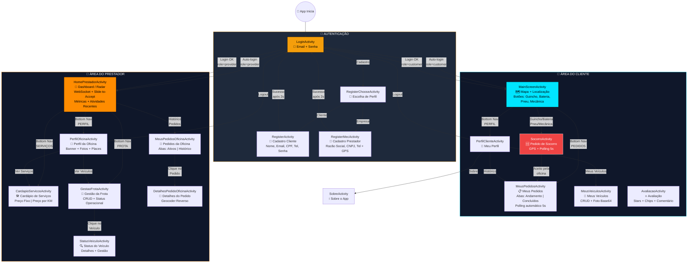

---

## 2. Fluxo de Autenticação

### 2.1 Login Completo

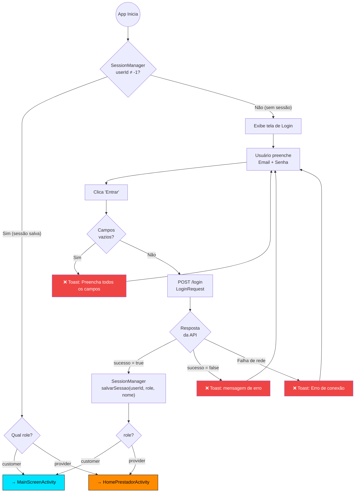

### 2.2 Cadastro

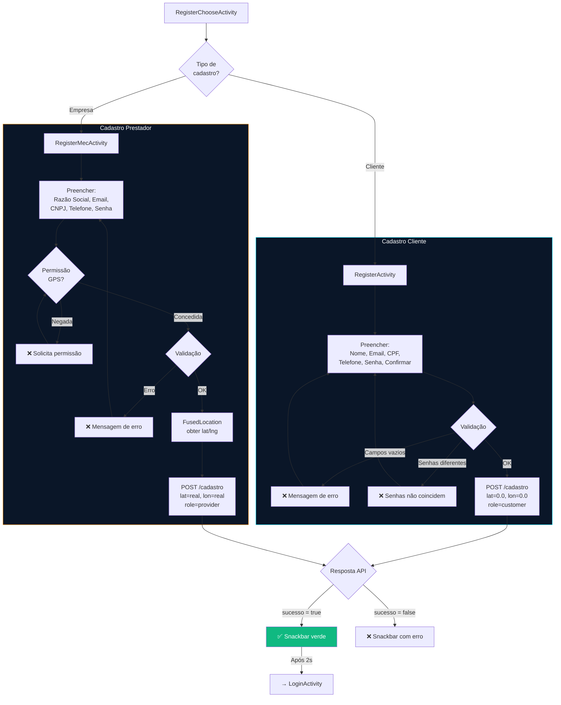

---

## 3. Fluxo de Socorro Mecânico (Tempo Real)

Este é o **fluxo principal** do aplicativo:

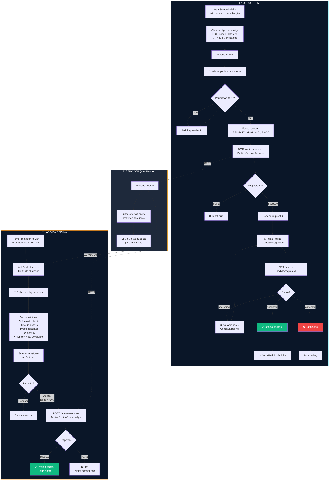

---

## 4. Fluxo do Dashboard do Prestador

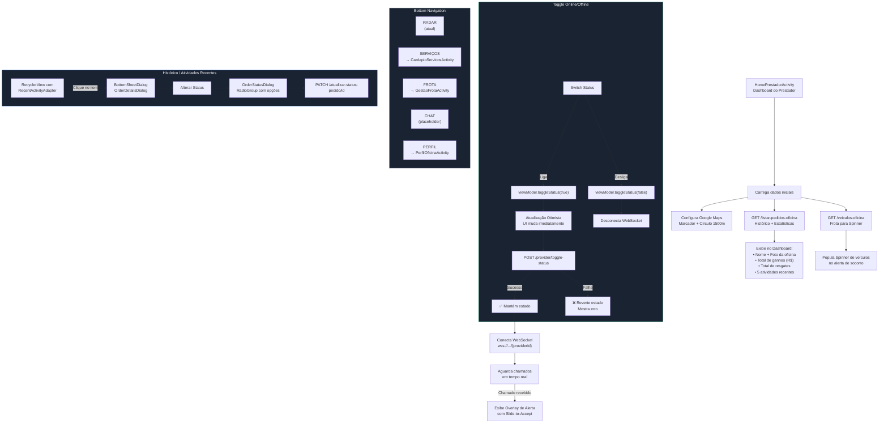

---

## 5. Fluxo de Gestão de Serviços

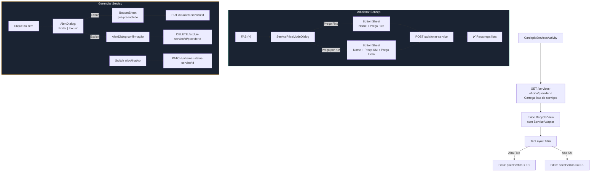

---

## 6. Fluxo de Gestão de Veículos

### 6.1 Gestão de Frota (Prestador)

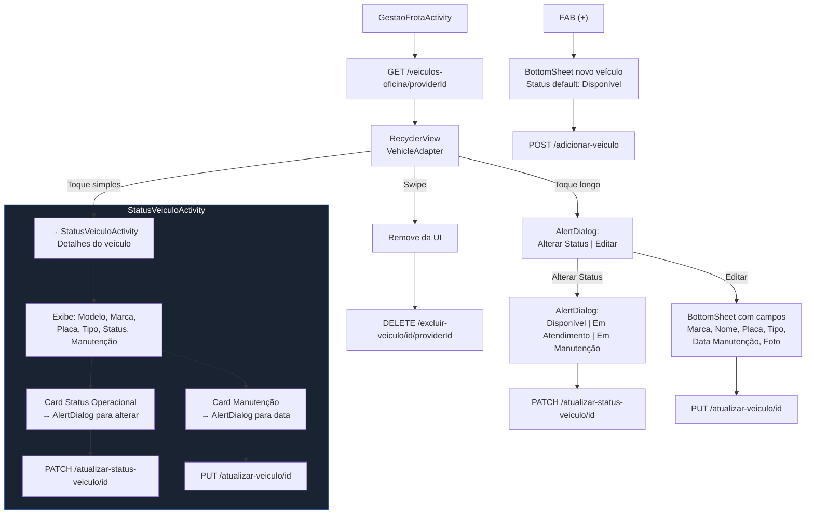

### 6.2 Veículos do Cliente

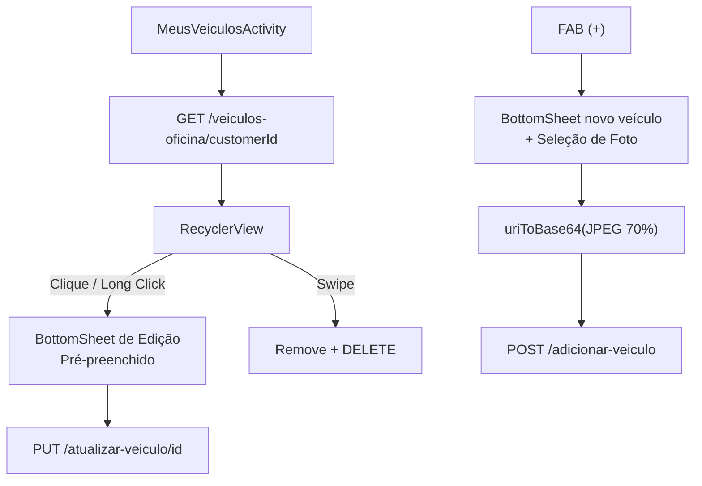

---

## 7. Diagrama de Sequência — Socorro Completo

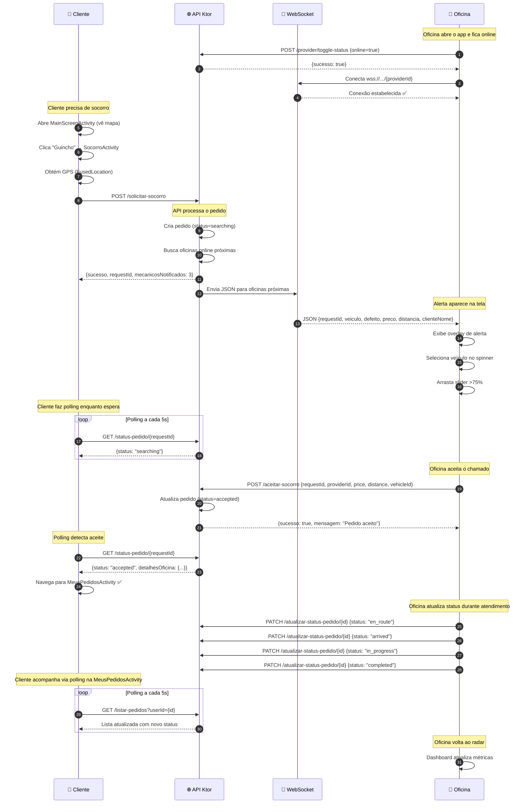

---

## 8. Mapa de Endpoints da API

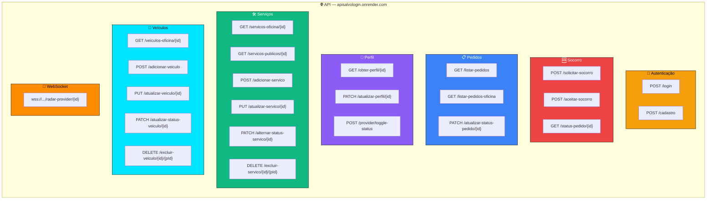

---

## 9. Diagrama de Entidade-Relacionamento (Models)

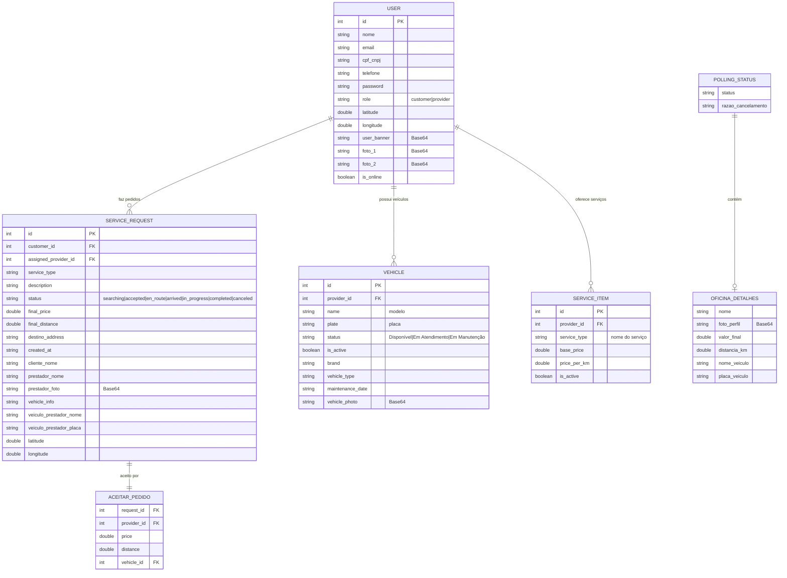

---

## Legenda de Cores dos Fluxogramas

| Cor | Significado |
|-----|------------|
| 🟦 Azul Neon (`#00E5FF`) | Área do Cliente |
| 🟧 Laranja (`#FF8C00`) | Área do Prestador |
| 🟨 Âmbar (`#F59E0B`) | Autenticação |
| 🟩 Verde (`#10B981`) | Sucesso / Confirmação |
| 🟥 Vermelho (`#EF4444`) | Erro / Socorro / Cancelamento |
| 🟪 Roxo (`#8B5CF6`) | Perfil / Status "No Local" |
| ⬜ Cinza (`#64748B`) | Navegação / UI genérica |

---

> **Documento gerado em:** 31/05/2026
> **Projeto:** Salvô v1.0
