# 📊 Relatório de Criação e Análise — Projeto Salvô

> **Data:** 31/05/2026 &nbsp;|&nbsp; **Versão analisada:** 1.0 &nbsp;|&nbsp; **Plataforma:** Android (Kotlin)

---

## 1. Visão Executiva

O **Salvô** é um aplicativo Android nativo que funciona como um **marketplace de serviços mecânicos em tempo real**, conectando motoristas em situação de emergência a oficinas mecânicas próximas. O sistema opera com **dois perfis distintos** (Cliente e Prestador) e utiliza um **backend próprio em Ktor hospedado no Render**, comunicando-se via API REST (Retrofit) e WebSocket para notificações em tempo real.

### Dados do Projeto

| Métrica | Valor |
|---------|-------|
| **Total de arquivos Kotlin** | 38 arquivos |
| **Total de Activities** | 18 telas |
| **Total de Models** | 9 arquivos (15+ data classes) |
| **Total de Adapters** | 5 adaptadores |
| **Total de Dialogs** | 3 bottom sheets |
| **Total de Layouts XML** | 33 layouts |
| **Total de Endpoints API** | 22 rotas REST + 1 WebSocket |
| **Linhas de código estimadas** | ~4.500+ linhas Kotlin |
| **Min SDK** | API 25 (Android 7.1) |
| **Target SDK** | API 36 (Android 16) |

---

## 2. Objetivos do Projeto

### Objetivo Principal
Criar uma plataforma mobile que permita o **encontro em tempo real** entre motoristas que precisam de socorro mecânico e oficinas/prestadores disponíveis na região.

### Objetivos Específicos
1. **Para o Cliente:**
   - Solicitar socorro mecânico com um toque (Guincho, Bateria, Pneu, Mecânica)
   - Acompanhar o status do atendimento em tempo real
   - Gerenciar seus veículos pessoais
   - Visualizar oficinas no mapa
   - Avaliar serviços recebidos

2. **Para o Prestador:**
   - Receber chamados de socorro em tempo real via WebSocket
   - Gerenciar cardápio de serviços com dois modos de precificação
   - Controlar frota de veículos com status operacional
   - Acompanhar histórico de atendimentos e métricas
   - Gerenciar perfil completo com fotos e localização

---

## 3. Análise de Arquitetura

### 3.1 Padrão Arquitetural

O projeto utiliza uma **arquitetura híbrida**, com tendência ao **MVVM (Model-View-ViewModel)** que está em **fase de adoção parcial**:

| Camada | Implementação | Maturidade |
|--------|---------------|------------|
| **Model** | ✅ 9 arquivos com 15+ data classes | Completa |
| **View** | ✅ 18 Activities + ViewBinding | Completa |
| **ViewModel** | ⚠️ 1 ViewModel (`HomePrestadorViewModel`) | Parcial |
| **Repository** | ⚠️ 2 Repositories (1 funcional, 1 vazio) | Inicial |
| **Network** | ✅ RetrofitClient + WebSocketManager | Completa |

```
┌─────────────────────────────────────────────────────────┐
│                    ESTADO ATUAL                          │
│                                                         │
│   Activity ──────────────────────► RetrofitClient        │
│   (View)          chamada direta         (Network)      │
│                                                         │
│   HomePrestadorActivity ──► ViewModel ──► Repository    │
│   (View)                    (MVVM)        (Data)        │
│                                                         │
│   Demais Activities ─────────────► RetrofitClient       │
│   (View)           sem ViewModel        (Network)       │
└─────────────────────────────────────────────────────────┘
```

> [!IMPORTANT]
> A maioria das Activities (16 de 18) faz chamadas diretas ao `RetrofitClient` sem intermediação de ViewModel ou Repository. Apenas `HomePrestadorActivity` segue o padrão MVVM com ViewModel e StateFlow.

### 3.2 Comunicação com Backend

O projeto adota **duas estratégias de comunicação** complementares:

| Estratégia | Tecnologia | Uso | Direção |
|-----------|-----------|-----|---------|
| **REST API** | Retrofit 2 + Gson | CRUD, autenticação, consultas | App → Servidor |
| **WebSocket** | OkHttp WebSocket | Chamados de socorro em tempo real | Servidor → App |
| **Polling** | Coroutines (5s) | Atualização de listas de pedidos | App → Servidor |

### 3.3 Gerenciamento de Estado

| Mecanismo | Onde é usado |
|-----------|-------------|
| **SessionManager** (SharedPreferences) | Persistência de sessão local (userId, role, nome) |
| **StateFlow** | Estado online/offline na `HomePrestadorActivity` |
| **Intent Extras** | Passagem de dados entre Activities |
| **LiveData** (não utilizado) | Disponível mas não adotado |

---

## 4. Inventário Completo de Componentes

### 4.1 Telas por Perfil

#### 🔐 Fluxo de Autenticação (Compartilhado)
| # | Tela | Arquivo | Linhas | Função |
|---|------|---------|--------|--------|
| 1 | Login | `LoginActivity.kt` | ~137 | Login + auto-login |
| 2 | Escolha de Cadastro | `RegisterChooseActivity.kt` | ~44 | Roteamento para tipo de cadastro |
| 3 | Cadastro Cliente | `RegisterActivity.kt` | ~135 | Formulário com CPF/telefone |
| 4 | Cadastro Prestador | `RegisterMecActivity.kt` | ~193 | Formulário com CNPJ + GPS |

#### 👤 Área do Cliente (6 telas)
| # | Tela | Arquivo | Linhas | Função |
|---|------|---------|--------|--------|
| 5 | Home (Mapa) | `MainScreenActivity.kt` | ~191 | Mapa + botões de serviço |
| 6 | Socorro | `SocorroActivity.kt` | ~227 | Pedido de socorro + polling |
| 7 | Meus Pedidos | `MeusPedidosActivity.kt` | ~220 | Lista com abas + polling 5s |
| 8 | Meus Veículos | `MeusVeiculosActivity.kt` | ~240 | CRUD + foto Base64 |
| 9 | Perfil | `PerfilClienteActivity.kt` | ~103 | Perfil + navegação |
| 10 | Avaliação | `AvaliacaoActivity.kt` | ~76 | Rating + chips (placeholder) |

#### 🏪 Área do Prestador (7 telas)
| # | Tela | Arquivo | Linhas | Função |
|---|------|---------|--------|--------|
| 11 | Dashboard/Radar | `HomePrestadorActivity.kt` | **~572** | WebSocket + alerta + métricas |
| 12 | Cardápio de Serviços | `CardapioServicosActivity.kt` | ~297 | CRUD serviços (2 modos de preço) |
| 13 | Gestão de Frota | `GestaoFrotaActivity.kt` | ~342 | CRUD veículos + status |
| 14 | Status do Veículo | `StatusVeiculoActivity.kt` | ~203 | Detalhes + gestão de status |
| 15 | Pedidos da Oficina | `MeusPedidosOficinaActivity.kt` | ~106 | Lista com abas |
| 16 | Detalhes do Pedido | `DetalhesPedidoOficinaActivity.kt` | ~91 | Detalhes + Geocoder |
| 17 | Perfil da Oficina | `PerfilOficinaActivity.kt` | **~377** | Edição completa + fotos + Places |

#### ℹ️ Institucional
| # | Tela | Arquivo | Linhas | Função |
|---|------|---------|--------|--------|
| 18 | Sobre | `SobreActivity.kt` | ~54 | Informações do app |

### 4.2 Complexidade por Tela (Top 5)

```
HomePrestadorActivity   ████████████████████████████████  572 linhas
PerfilOficinaActivity   █████████████████████             377 linhas
GestaoFrotaActivity     ███████████████████               342 linhas
CardapioServicosActivity████████████████                  297 linhas
MeusVeiculosActivity    █████████████                     240 linhas
```

### 4.3 Models — Mapa de Relacionamentos

```mermaid
graph TD
    LR["LoginRequest"] -->|"POST /login"| AR["AuthResponse"]
    RR["RegisterRequest"] -->|"POST /cadastro"| AR
    PSReq["PedidoSocorroRequest"] -->|"POST /solicitar-socorro"| PSResp["PedidoSocorroResponse"]
    SR["ServiceRequest"] -->|"Usado por"| PA["PedidosAdapter"]
    SR -->|"Usado por"| POA["PedidosOficinaAdapter"]
    SR -->|"Usado por"| RAA["RecentActivityAdapter"]
    SI["ServiceItem"] -->|"Usado por"| SA["ServiceAdapter"]
    V["Vehicle"] -->|"Usado por"| VA["VehicleAdapter"]
    VR["VeiculoRequest"] -->|"POST /adicionar-veiculo"| AR
    APReq["AceitarPedidoRequestApp"] -->|"POST /aceitar-socorro"| APResp["AceitarPedidoResponse"]
    PSR["PollingStatusResponse"] -->|"Contém"| ODP["OficinaDetalhesPolling"]
```



---

## 5. Análise de Qualidade

### 5.1 ✅ Pontos Fortes

| Aspecto | Detalhes |
|---------|---------|
| **ViewBinding** | Adotado em todas as Activities — elimina `findViewById()` e garante type-safety |
| **Estrutura de pacotes** | Organização clara: `model/`, `network/`, `adapter/`, `dialog/`, `utils/` |
| **Comunicação em tempo real** | WebSocket bem implementado com reconexão automática |
| **Slide-to-accept** | UX inovadora para aceitar chamados (similar a apps de motorista) |
| **Múltiplos modos de preço** | Suporte a preço fixo e preço por KM — flexibilidade comercial |
| **Masks de entrada** | Formatação automática de CPF, CNPJ, telefone, placa, preço |
| **Polling inteligente** | Modo silencioso para evitar spam de erros durante polling automático |
| **Atualização otimista** | Toggle online/offline com rollback automático em caso de falha |
| **Fotos em Base64** | Suporte a fotos de perfil, banner e veículos |
| **Geocodificação** | Conversão de coordenadas em endereço legível via Geocoder |
| **Tratamento de erros** | Parsing de erros da API com Gson para mensagens detalhadas |
| **SessionManager** | Auto-login e gerenciamento de sessão com SharedPreferences |
| **Edge-to-edge** | Layouts adaptados para telas com barras de sistema |

### 5.2 ⚠️ Oportunidades de Melhoria

| Prioridade | Área | Situação Atual | Recomendação |
|-----------|------|----------------|--------------|
| 🔴 Alta | **Segurança** | API Key do Google Maps hardcoded no código | Mover para `local.properties` ou `BuildConfig` |
| 🔴 Alta | **Dependências** | Firebase declarado mas não utilizado | Remover dependências do Firebase do `build.gradle.kts` |
| 🟡 Média | **Arquitetura** | 16/18 Activities sem ViewModel | Expandir MVVM para todas as telas |
| 🟡 Média | **Repositórios** | Apenas 1 Repository funcional de 2 | Criar Repositories para cada domínio |
| 🟡 Média | **Polling** | Polling a cada 5s consome bateria/dados | Considerar push notifications (FCM) |
| 🟡 Média | **Imagens** | Base64 inline (strings grandes em JSON) | Considerar upload de arquivos com URL |
| 🟢 Baixa | **Testes** | Sem testes unitários/instrumentados | Adicionar testes para lógica de negócio |
| 🟢 Baixa | **Injeção de Dep.** | Factory manual para ViewModel | Considerar Hilt/Dagger para DI |
| 🟢 Baixa | **Chat** | Placeholder (Toast "Em breve") | Implementar com WebSocket existente |
| 🟢 Baixa | **Avaliação** | Dados apenas no Logcat | Integrar com endpoint da API |

### 5.3 Funcionalidades Pendentes (Placeholders)

| Funcionalidade | Tela | Status |
|----------------|------|--------|
| 💬 Chat em tempo real | Todas (bottom nav) | Toast "Em breve" |
| ⭐ Envio de avaliação | `AvaliacaoActivity` | Dados apenas no Logcat |
| 📜 Termos de Uso | `SobreActivity` | Apenas Toast |
| 🔒 Política de Privacidade | `SobreActivity` | Apenas Toast |
| 👨‍💻 Equipe de Desenvolvedores | `SobreActivity` | Apenas Toast |
| 🔄 ProviderHomeRepository | `HomePrestadorActivity` | Classe vazia |

---

## 6. Análise de Segurança

> [!CAUTION]
> Os itens abaixo representam riscos de segurança que devem ser tratados antes de publicar o app na Play Store.

| # | Risco | Localização | Impacto | Recomendação |
|---|-------|-------------|---------|--------------|
| 1 | **API Key exposta** | `PerfilOficinaActivity.kt:39` | A chave pode ser usada por terceiros | Mover para `BuildConfig` via `local.properties` |
| 2 | **API Key no Manifest** | `AndroidManifest.xml:29` | Chave do Google Maps visível | Usar restrições de API no Console Google |
| 3 | **Cleartext Traffic** | `AndroidManifest.xml:19` | Tráfego HTTP não criptografado permitido | Desabilitar para produção |
| 4 | **Firebase não utilizado** | `build.gradle.kts:58-61` | Aumenta tamanho do APK sem necessidade | Remover dependências |
| 5 | **Sem token JWT** | `SessionManager` | Sessão baseada apenas em userId local | Implementar autenticação por token |

---

## 7. Métricas de Dependências

### Dependências Ativas (Realmente Utilizadas)

| Dependência | Utilização Confirmada |
|------------|----------------------|
| Retrofit 2 | ✅ Todas as chamadas REST |
| Gson Converter | ✅ Serialização JSON |
| OkHttp Logging | ✅ Debug de requisições |
| Google Maps | ✅ MainScreen, HomePrestador, Socorro |
| Google Places | ✅ Autocomplete em RegisterMec, PerfilOficina |
| Play Services Location | ✅ GPS em várias Activities |
| Material Design 3 | ✅ Componentes visuais |
| Lifecycle ViewModel | ✅ HomePrestadorViewModel |
| Lifecycle Runtime KTX | ✅ Coroutines com lifecycleScope |
| ConstraintLayout | ✅ Layouts |
| AppCompat | ✅ Compatibilidade |

### Dependências Não Utilizadas (Candidatas a Remoção)

| Dependência | Motivo |
|------------|--------|
| `firebase-bom:32.7.0` | ❌ Firebase não é utilizado no projeto |
| `firebase-auth-ktx` | ❌ Autenticação é feita via API REST |
| `firebase-firestore-ktx` | ❌ Dados são armazenados no backend próprio |
| `com.google.gms.google-services` (plugin) | ❌ Plugin do Firebase não necessário |

---

## 8. Fluxo de Dados — Visão Geral

### 8.1 Fluxo de Autenticação
```
LoginActivity
  ├── SessionManager.buscarUserId() ≠ -1 → Auto-login por role
  ├── POST /login → AuthResponse
  │   ├── sucesso → SessionManager.salvarSessao(userId, role, nome)
  │   │   ├── role=customer → MainScreenActivity
  │   │   └── role=provider → HomePrestadorActivity
  │   └── falha → Toast com mensagem de erro
  └── Cadastro → RegisterChooseActivity
      ├── Cliente → RegisterActivity → POST /cadastro → LoginActivity
      └── Empresa → RegisterMecActivity → POST /cadastro (com GPS) → LoginActivity
```

### 8.2 Fluxo de Socorro (Fluxo Principal do App)
```
1. Cliente abre MainScreenActivity → vê mapa com localização
2. Clica em tipo de serviço (Guincho/Bateria/Pneu/Mecânica)
3. SocorroActivity:
   a. Obtém GPS (FusedLocationProviderClient)
   b. POST /solicitar-socorro → API cria pedido
   c. API notifica oficinas online via WebSocket
   d. Inicia polling a cada 5s
   
4. HomePrestadorActivity (Oficina):
   a. WebSocket recebe JSON com dados do chamado
   b. Exibe overlay de alerta com detalhes
   c. Prestador seleciona veículo no spinner
   d. Arrasta slider >75% para aceitar
   e. POST /aceitar-socorro → API atualiza pedido
   
5. SocorroActivity (Cliente):
   a. Polling detecta status "accepted"
   b. Navega para MeusPedidosActivity
   
6. Acompanhamento:
   a. Oficina atualiza status: en_route → arrived → in_progress → completed
   b. Cliente vê atualizações via polling na lista de pedidos
```

### 8.3 Fluxo de Gestão (CRUD)
```
Serviços: CardapioServicosActivity
  └── GET /servicos-oficina/{id} → List<ServiceItem>
  └── POST /adicionar-servico → AuthResponse
  └── PUT /atualizar-servico/{id} → AuthResponse
  └── PATCH /alternar-status-servico/{id} → AuthResponse
  └── DELETE /excluir-servico/{id}/{providerId} → AuthResponse

Veículos: GestaoFrotaActivity / MeusVeiculosActivity
  └── GET /veiculos-oficina/{id} → List<Vehicle>
  └── POST /adicionar-veiculo → AuthResponse
  └── PUT /atualizar-veiculo/{id} → AuthResponse
  └── PATCH /atualizar-status-veiculo/{id} → AuthResponse
  └── DELETE /excluir-veiculo/{id}/{providerId} → AuthResponse

Perfil: PerfilOficinaActivity
  └── GET /obter-perfil/{id} → Map<String, String?>
  └── PATCH /atualizar-perfil/{id} → AuthResponse
```

---

## 9. Conclusão

O projeto Salvô demonstra uma base sólida para um aplicativo de marketplace de serviços mecânicos. Os pontos mais impressionantes são:

1. **Comunicação em tempo real** via WebSocket com reconexão automática
2. **UX inovadora** com o slide-to-accept para aceitar chamados
3. **Sistema dual completo** com fluxos distintos e completos para Cliente e Prestador
4. **22 endpoints REST** bem organizados cobrindo todo o CRUD necessário
5. **Geolocalização inteligente** com Google Maps, Places e Geocoder

As principais áreas de evolução envolvem expandir o padrão MVVM para todas as telas, implementar o chat em tempo real (aproveitando a infraestrutura WebSocket já existente), integrar a funcionalidade de avaliação com a API, e resolver os pontos de segurança identificados.

---

> **Relatório gerado em:** 31/05/2026
> **Analista:** Antigravity AI
> **Projeto:** Salvô v1.0
